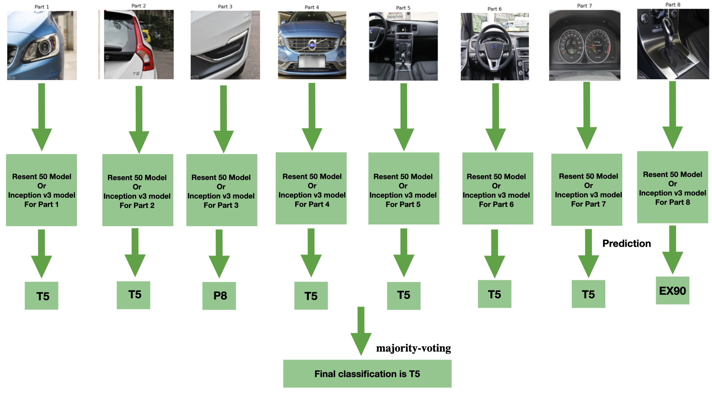
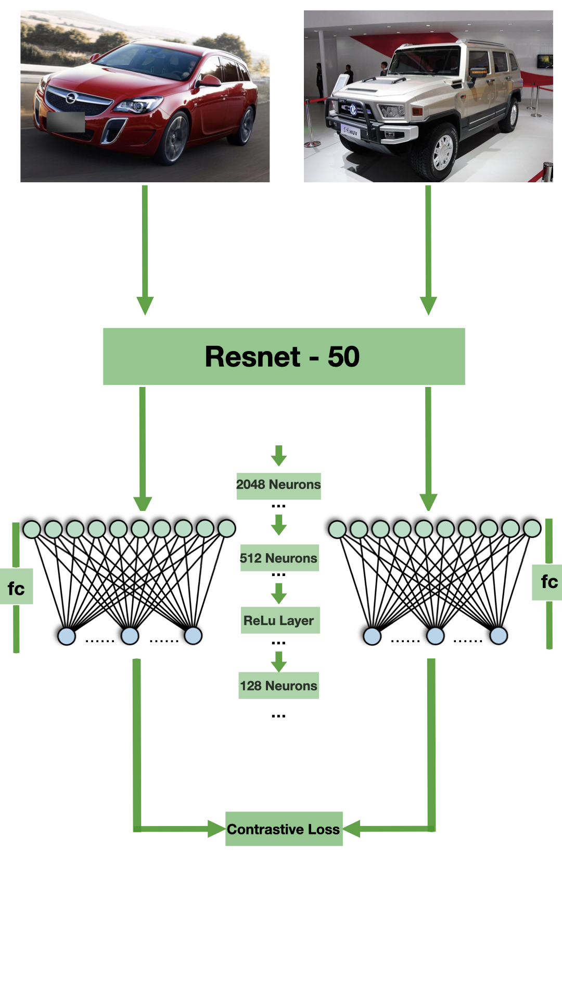

# README for Car Classification Repository

## Car Classification and Verification using Deep Learning

This repository contains the implementation of a deep learning-based pipeline for **fine-grained car classification** and **verification** using **ResNet-50**, **Inception v3**, and **Siamese Networks**. The models are trained and evaluated on the **CompCars dataset**, leveraging **ensemble learning, transfer learning, and contrastive learning** to improve classification and verification accuracy. 

## Features

- **Car Make & Model Classification:** Predicts the manufacturer (make) and specific model of a car using **ResNet-50** and **Inception v3**.
- **Part-Based Ensemble Learning:** Uses an ensemble method where car parts (e.g., headlights, taillights, dashboard) are independently classified, and a **majority voting strategy** improves accuracy.
- **Car Verification (Siamese Network):** Determines if two images belong to the same car make/model using a **contrastive learning-based Siamese network**.
- **Optimized Preprocessing Pipeline:** Includes image resizing, augmentation, and normalization tailored for both **ResNet-50** and **Inception v3**.

---

## 🔍 Dataset

The project is trained and tested on the **CompCars dataset**, which includes **web-nature** (online images) and **surveillance-nature** (real-world camera) images.

- **Make & Model Classification:** Uses **full car images** for classification.
- **Part-Based Classification:** Uses cropped **car parts** (headlight, taillight, fog light, etc.) to refine predictions.
- **Verification Task:** Pairs of images are used for training the **Siamese Network**.

---

## 🖼️ Part-Based Classification Example
This image shows how different car parts contribute to the prediction of the final model classification decision.

## 🖼️ Siamese Network for Verification
This image illustrates how the Siamese Network verifies if two car images belong to the same model.

---

## 📊 Results

### 🎯 **Make & Model Classification Accuracy**
| Model        | Make Classification (%) | Model Classification (%) |
|-------------|------------------------|-------------------------|
| ResNet-50   | 92.78%                  | 90.15%                  |
| Inception v3| 93.35%                  | 89.48%                  |

### 🎯 **Part-Based Classification Accuracy (Top-1 Accuracy)**
| Car Part  | ResNet-50 (%) | Inception v3 (%) |
|-----------|--------------|------------------|
| Headlight | 53.28%       | 43.33%           |
| Taillight | 64.00%       | 57.00%           |
| Fog Light | 29.19%       | 22.28%           |
| Console   | 54.42%       | 38.72%           |
| Steering  | 54.72%       | 37.30%           |
| Dashboard | 52.86%       | 27.95%           |
| **Voting** | **81.51%**  | **72.53%**       |

### 🎯 **Car Model Verification Accuracy**
| Model               | Easy (%) | Medium (%) | Hard (%) |
|--------------------|---------|------------|---------|
| Siamese Network (Ours) | 88.64%  | 87.72%     | 82.61%  |
| CNN + Joint Bayesian  | 83.30%  | 82.40%     | 76.10%  |
| CNN + SVM            | 70.00%  | 69.00%     | 65.90%  |

---

## 💡 Key Contributions

✅ **Fine-Tuned CNN Models:** Improved **classification accuracy** by using **transfer learning** on **ResNet-50** and **Inception v3**.  
✅ **Part-Based Classification with Majority Voting:** Reduced misclassification errors by combining individual part predictions.  
✅ **Car Verification via Siamese Network:** Outperformed **traditional metric-learning** methods like **SVM** and **Joint Bayesian**.  
✅ **Real-World Applicability:** Suitable for **automated surveillance, intelligent transportation, and automotive inventory management**.  

---

## 🔬 Future Work

- Implement **attention-based models** to improve feature extraction.
- Train models on **larger, more diverse datasets**.
- Optimize the **computational efficiency** of the pipeline.

---

## 👨‍💻 Authors

- **Ehsan Eslami Shafigh**
- **Sepideh Ghaemifar**
- **Abbas Zal**

---
